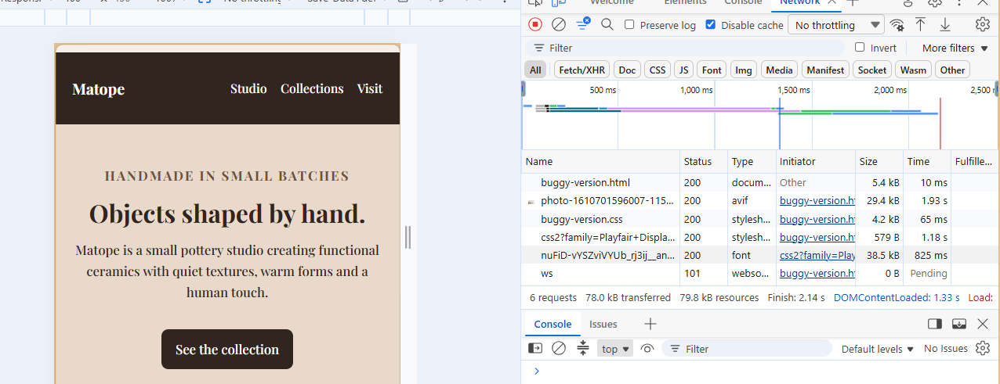
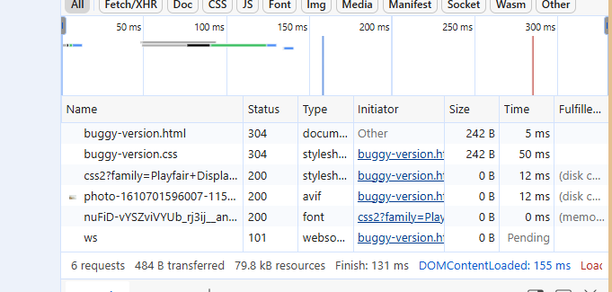

# Build Log – Group 3 (Pottery Studio)
**Assignment:** ELE-IWS-521 Assignment 2  
**Theme:** Small Pottery Studio  
**Breakpoint:** 640px  
**Group Members:** Annie Thomas, Andrea Aston, Uchindami Mkandawire

---

## Entry 1 – [24 August 2026]
**Task:** Created initial HTML structure and navigation.
**Status:** ✅ Completed.

---

##  Entry 2 – [24 August 2026]
**Task:** Added feature cards and responsive 640px layout.
**Status:** ✅ Completed.
**Note:** Cards stack correctly on mobile.

---

## Entry 3 – [24 August 2026]
**Task:** Merged all branches and resolved conflicts.
**Status:** Merge conflict in `style.css` – resolved by keeping both nav and card styles.

---
## Entry 4 – [24 August 2026]
**Task:** Adjusted the responsiviness of the webpage.
**Status:** No side scrolling of the webpage.

---

## Entry 5 – [25 August 2026, From 11:00 AM]
**Task:** Planted bugs in `buggy-version.html` and `buggy-version.css`.
**Status:** ✅ Done.

---

##  Bug Gauntlet Evidence (Part B)

### Bug #7 – Annie Thomas (Missing `flex-wrap`)
- **Location:** `buggy-version.css` – `.feature-row` has `flex-wrap: now wrap`.
- **Screenshot:** 
- **Explanation:** Put your explanation here
- **Fix:**  Put youtr fix here, as i have donw below just a cporrection of the plannted bag as  bracketed (Add `flex-wrap: wrap;` to `.nav-links` and remove `white-space: nowrap;`).

### Bug #2 – Andrea Aston (Inline `display:flex` beats media query)
- **Location:** `buggy-version.html` – `<nav class="site-nav" style="display:flex; flex-direction:row;">`
- **Screenshot:** 
- **Explanation:** The inline style forces the links in the nav bar to stay in a row on mobile, overriding the media query's `flex-direction: column`.
- **Fix:** Remove `style="display:flex; flex-direction:row;"` from the HTML.

### Bug #5 – Uchindami Mkanawire (Missing `box-sizing: border-box`)
- **Location:** `buggy-version.css` – removed the `* { box-sizing: border-box; }` rule.
- **Screenshot:** 
- **Explanation:** Without `box-sizing`, the padded feature cards exceed 100% width on mobile, causing overflow.
- **Fix:** Add `box-sizing: border-box;` back to the universal selector.

---

## 🌐 Network Investigation (Part C)
### 1. Google Font request
The page requests Playfair Display from Google Fonts. *

- Status: **[ 200]**
- Content-Type: **[ Stylesheet]**
- Screenshot: **[attach screenshot]**

### 2. Why the CSS request affects visible rendering
The stylesheet is linked in `<head>`. CSS is render-blocking because the browser needs the stylesheet before it can reliably calculate the final presentation of the document. Therefore, the browser can delay painting visible content while the CSS resource is being fetched and processed.

If the stylesheet link were moved to the end of `<body>`, the browser could initially display unstyled HTML and then apply the stylesheet after it arrives. This can create a flash of unstyled content and a noticeable layout shift. Keeping the stylesheet in `<head>` gives the browser the CSS early and avoids that poor loading experience.

**Screenshot:** 

### 3. External image versus index.html timing
The image is fetched from an external origin, while `index.html` is the initial document. The image request can involve separate DNS lookup, connection/TLS negotiation, server waiting/TTFB and content download. Consequently, an external image can have a longer total duration even when its file size is smaller than the HTML document.

Below are the actual time  foir the two files
| `index.html` | 10ms|
| External image | 1930ms|

as shown in the screenshot: 

### 4. Second load and 304
Reload the page a second time without clearing the cache and inspect the Playfair Display request.

- First load status: **[ 200]**
- Second load status: **[ 200, However this is loaded from the cache  shwon by the 0B that is in the screenshot, just that the status 200 is shown as a fresh copy because the browser didnt even ask  if there is a fresh copy]**
- Screenshot: **[]**

A `304 Not Modified` response tells the browser that the cached resource is still valid, so the cached copy can be reused. If the browser satisfies the request directly from its cache without making a conditional request to the server, you may see a cached result instead of a 304.
---

## 📝 Reflection (Part E)

### 1. One CSS rule
The `.feature-row { display: flex; }` rule is essential because it creates the flex formatting context used to arrange the three studio collections in a row. Removing it would return the section to ordinary block flow and break the intended desktop layout.

### 2. Flexbox versus floats
Flexbox makes it straightforward to give the three cards flexible widths, control their gap, and change the direction at the 640px breakpoint. Floats would require additional width calculations, clearing and more manual responsive layout control.

### 3. Individual reflections
**Annie Thomas:** I owned Bug #7, where removing `flex-wrap` stopped the flex row from wrapping. The symptom occurred because flex containers default to a single line, so the items could not move onto another line.

**Andrea Aston:** I owned Bug #2, where an inline `display:flex` declaration conflicted with the responsive CSS. The bug demonstrates that inline styles have high cascade priority and can override normal stylesheet rules.

**Uchindami Mkandawire:** I owned Bug #5, where removing `box-sizing: border-box` caused the padded flex child to overflow. The issue came from the default `content-box` sizing model adding padding and borders outside the declared size.
